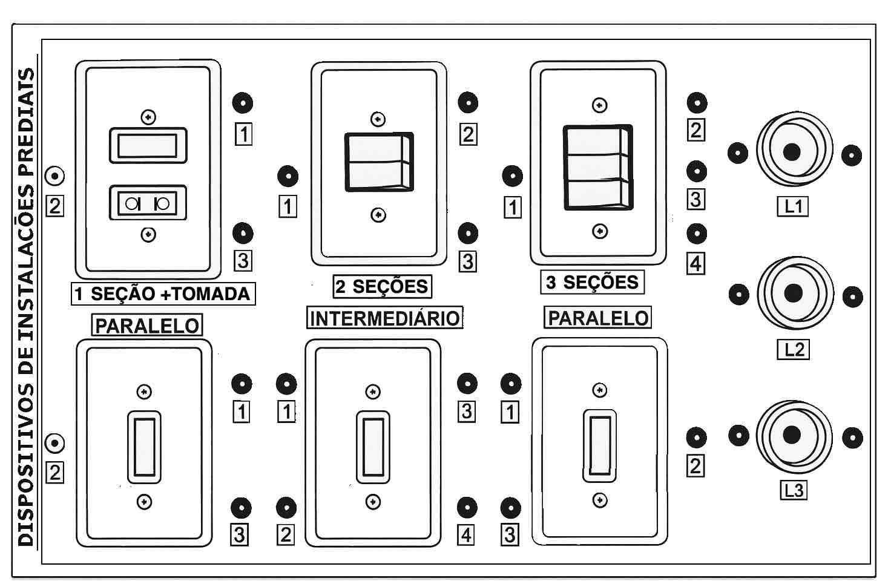
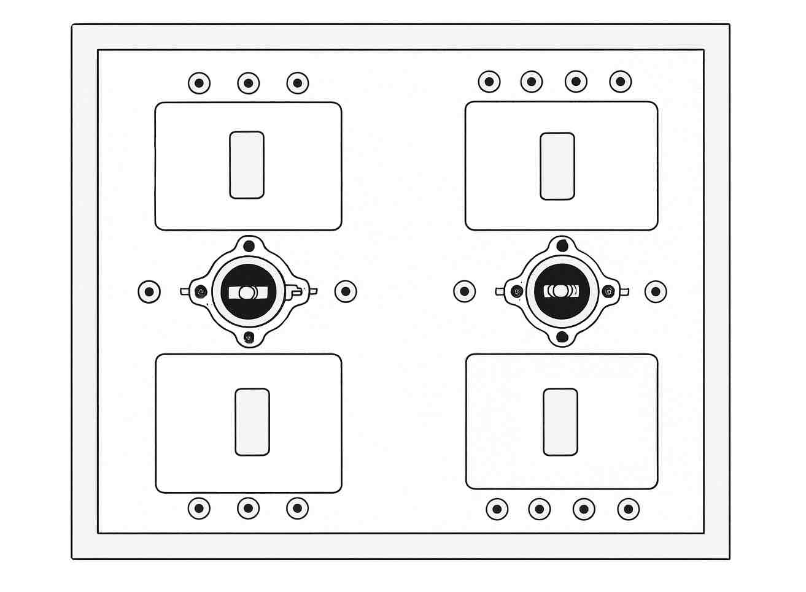
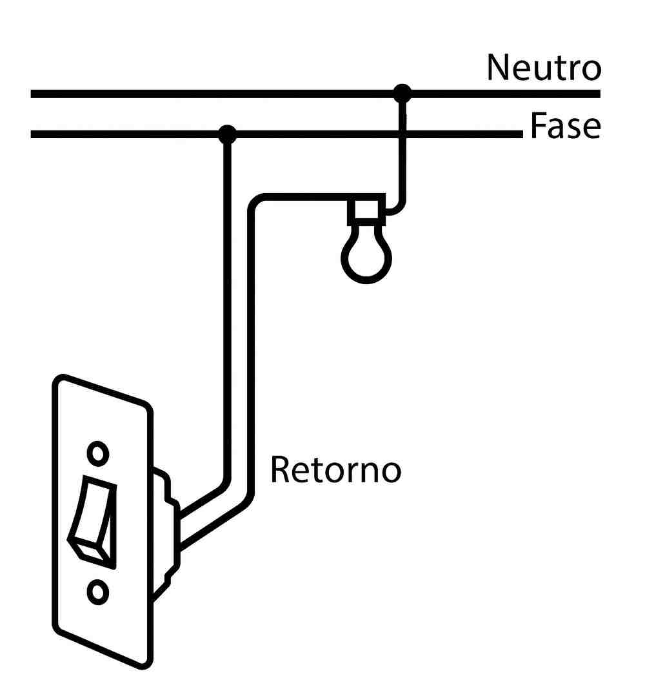
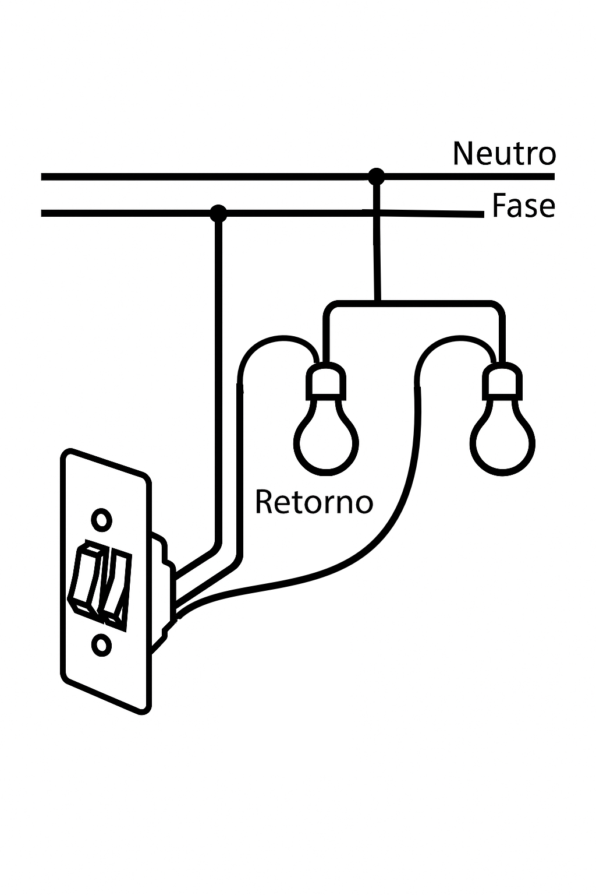
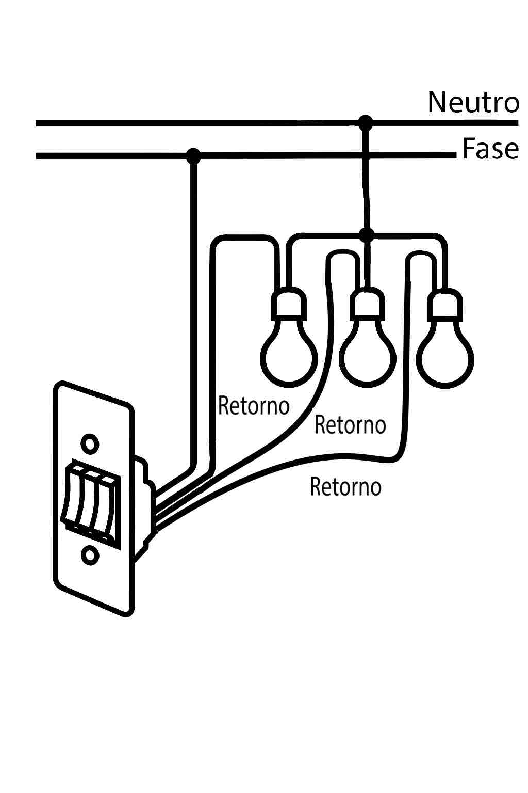
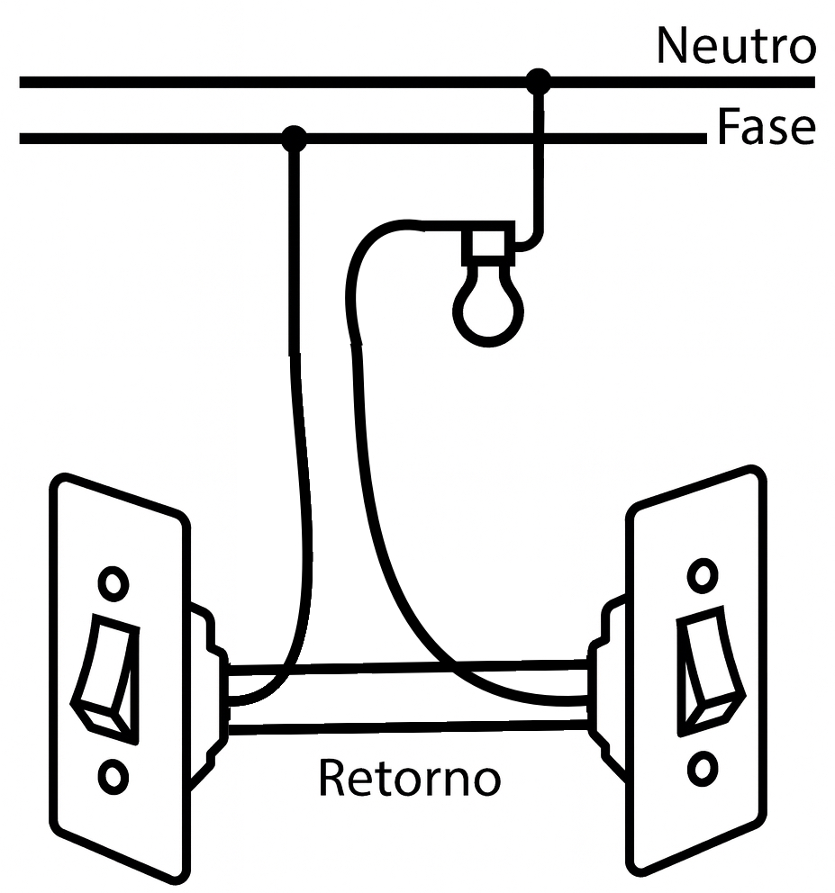
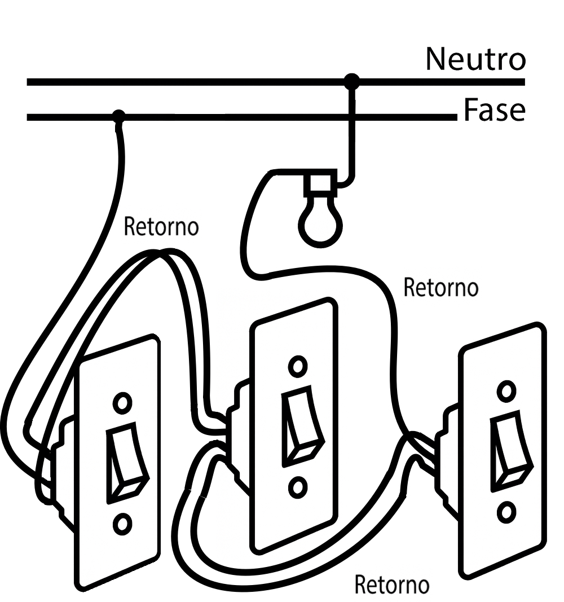

<td style="width: 10%;">
    
</td>

### **CENTRO FEDERAL DE EDUCAÇÃO TECNOLÓGICA DE MINAS GERAIS**  
### **Departamento de Engenharia Elétrica - CEFET-MG**  
### **Coordenação do Curso de Eletrotécnica**  

### Disciplina: **PLIP - Prática de Laboratório de Instalações Prediais**
### Aula Prática Montagens Elétricas no Painel Didático – Interligações Funcionais de Iluminação e Tomadas

---

## Objetivos da Aula

Ao final desta atividade, o aluno será capaz de:

- Identificar e aplicar corretamente interruptores simples, paralelos e intermediários.
- Executar circuitos de iluminação sobre painel didático de bancada com base na NBR 5410.
- Interpretar diagramas unifilares e multifilares e aplicá-los na prática.
- Organizar e executar a passagem e conexão de condutores em painéis.
- Testar e validar cada circuito conforme o funcionamento esperado.
- Registrar medições e anomalias observadas durante a prática.

---
## Introdução

A atividade propõe a realização de cinco montagens elétricas no painel didático de bancada, com o objetivo de desenvolver a prática de instalações prediais conforme a NBR 5410. Os alunos deverão identificar fase, neutro e retorno, interpretar diagramas, organizar condutores e executar conexões de forma segura e funcional.

As montagens incluem:

- Interruptor simples comandando uma lâmpada, com uma tomada alimentada diretamente.
- Interruptor de duas seções acendendo duas lâmpadas de forma independente.
- Interruptor triplo comandando três lâmpadas distintas.
- Circuito paralelo (three-way) utilizando dois interruptores para acionar uma mesma lâmpada a partir de dois pontos.
- Circuito com interruptor intermediário (four-way) permitindo acionamento de uma lâmpada por três pontos diferentes.
  
---

## Materiais Necessários

- Painel didático de bancada
- Interruptor simples
- Interruptor de duas seções
- Interruptor de três seções
- Interruptores paralelos (three-way)
- Interruptor intermediário (four-way)
- Tomada 2P+T
- Soquetes e lâmpadas LED
- Condutores 1,5 mm² (iluminação)
- Condutores 2,5 mm² (tomada)
- Chave de fenda e Philips
- Alicate universal e decapador
- Multímetro
- Fita isolante
- Esquemas fornecidos pelo professor

---
## Painel Didático

Permite a montagem de:
- Circuitos de iluminação simples;
- Comandos independentes por interruptores simples, duas e três seções, tomada, interruptor paralelo e intermediário 

Permite a montagem de:
- Circuitos de iluminação simples;
- Comandos independentes por interruptores paralelo e intermediários.

---

## Atividades Práticas

### 1) Interruptor simples comandando uma lâmpada e uma tomada

### Objetivo
Montar um circuito no qual um interruptor simples aciona uma lâmpada, enquanto a tomada recebe alimentação direta do circuito.

**O aluno deverá:**
1. Identificar fase e neutro no painel.
2. Levar fase interrompida ao soquete da lâmpada.
3. Levar neutro direto à lâmpada.
4. Alimentar a tomada com fase e neutro diretos.
5. Testar o funcionamento com o professor.

---

### 2) Interruptor de duas seções comandando duas lâmpadas

### Objetivo
Controlar duas lâmpadas de forma independente usando um único interruptor com duas teclas.

**O aluno deverá:**
1. Alimentar a entrada comum das duas seções com a mesma fase.
2. Passar cada retorno para sua respectiva lâmpada.
3. Ligar o neutro direto para ambas as lâmpadas.
4. Realizar o teste de comutação individual.

---

## 3) Interruptor de três seções comandando três lâmpadas

### Objetivo
Utilizar um interruptor triplo para comandar três pontos de luz distintos.

**O aluno deverá:**
1. Identificar a entrada comum (fase).
2. Distribuir a fase para as três teclas (ponteamento).
3. Organizar e ligar os três retornos de acordo com o esquema.
4. Testar e registrar o funcionamento de cada circuito.

---

## 4) Dois interruptores paralelos (three-way) comandando uma lâmpada

### Objetivo
Montar um circuito de iluminação controlado por dois pontos distintos.

**O aluno deverá:**
1. Identificar os bornes: comum e dois viajantes.
2. Ligar os viajantes entre os dois interruptores.
3. Conectar a fase ao comum do primeiro interruptor.
4. Conectar o retorno ao comum do segundo interruptor.
5. Validar o funcionamento em ambas as posições.

---

## 5) Dois interruptores paralelos + um intermediário (four-way) comandando uma lâmpada

### Objetivo
Montar um circuito em que três pontos diferentes controlam uma única lâmpada.

**O aluno deverá:**
1. Montar os dois interruptores paralelos (three-way).
2. Inserir o interruptor intermediário (four-way) entre eles.
3. Executar a ligação cruzada dos viajantes no intermediário.
4. Testar em todas as combinações possíveis.

---

## Diagramas

Elabore os diagramas unifilar correspondentes às cinco montagens.

---

## Procedimentos de Teste

1. Verificar continuidade dos condutores.
2. Identificar fase com o multímetro.
3. Testar funcionamento das lâmpadas e tomadas.
4. Conferir isolamentos e aperto dos bornes.
5. Solicitar inspeção final do professor.

---

## Finalização da Atividade

- Desligar a alimentação geral.
- Remover todos os condutores do painel.
- Devolver interruptores, tomadas e acessórios.
- Organizar ferramentas e bancada.
